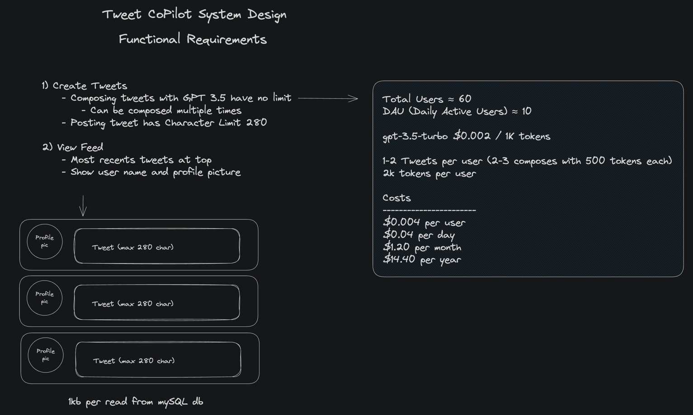
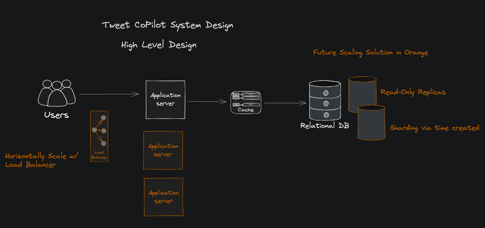

# Tweet CoPilot
`Twitter Clone w/ ChatGPT`

Say goodbye to the struggle of fitting your thoughts into a tweet! 🤯 Introducing TweetCoPilot - the revolutionary social media platform that uses ChatGPT to keep your messages within the character limit. 🚀 Sign up now and join the future of effortless self-expression and connection. 🙌 #TweetCoPilot #SocialMedia

*^ Generated by TweetCoPilot*

## https://tweetcopilot.vercel.app/

### Tech Stack
React, NextJS, MySQL,TRPC, Prisma

## Screenshots


## Table of Contents

- [Tweet CoPilot](#tweet-copilot)
  - [Purpose](#purpose)
  - [System Design](#system-design)
  - [Getting Started](#getting-started)

## Purpose

The TweetCoPilot application aims to revolutionize the social media experience by leveraging the power of ChatGPT to assist users in crafting tweets within the character limit. With its intuitive interface, intelligent suggestions, and seamless social interactions, TweetCoPilot empowers users to express themselves effortlessly and engage with their followers in a whole new way.

Users can enter their tweet content, and the application provides real-time suggestions and corrections to help keep the tweet within the character limit.
With Intelligent Summarization, when tweets exceed the character limit, the application leverages the ChatGPT model to intelligently summarize the content while preserving the intended meaning.


## System Design





## Getting Started

1. Clone the repo
```bash
git clone https://github.com/UnloadingGnat/tweetcopilot.git
```
2. Install dependencies
```bash
npm install
```
3. Create a .env file in the root directory and add the following
```bash
# Db and auth
DATABASE_URL=''
NEXT_PUBLIC_CLERK_PUBLISHABLE_KEY=
CLERK_SECRET_KEY=
# OpenAI
OPENAI_API_KEY=
```
4. Run the development server
```bash
npm run dev
```
5. Open [http://localhost:3000](http://localhost:3000) with your browser to see the result.


